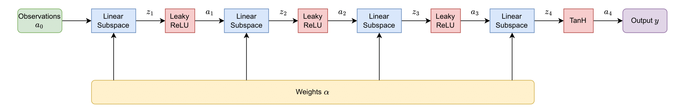

# Subspace Agents

## Context

**Figure 1.** Subspace Network

Let us consider a $N$-dimensional subspace $\mathcal{S}$, and let $i$ be an integer in $\left[1,B\right]$. The subspace $\mathcal{S}$ has $N$ subspace anchors $\left(\Pi_i\right)_{i\in\left[1,N\right]}$ with parameters $\Theta_i$.

When training the subspace, we sample $B$ distinct policies $\pi_{\alpha^{(i)}}$ where the $\alpha^{(i)}\in\mathbb{R}^{1\times N}$ are weights sampled from a Dirichlet distribution $Dir\left(\mathcal{U}(N)\right)$:

$$
\begin{equation*}
    \alpha^{(i)} =
    \begin{bmatrix}
        \alpha_{1,1}^{(i)} & \ldots & \alpha_{1,N}^{(i)}
    \end{bmatrix}\sim Dir\left(\mathcal{U}(N)\right).
\end{equation*}
$$

In a single epoch, $K$ different actions are chosen for each policy $\pi_{\alpha^{(i)}}$, resulting in at most $K$ updates of the critics, the actor and the entropy. Throughout the rest of the document, we consider $K=1$.

The subspace $\mathcal{S}$ can be represented by a neural network having:

- Environment observations $a_0\in\mathbb{R}^{B\times S}$ as inputs;

- Dirichlet distributions weights $\alpha\in\mathbb{R}^{B\times N}$ as parameters. The matrix $\alpha$ can be seen as a vertical concatenation of all the row vectors $\alpha^{(i)}$ previously described;

- An output $y\in\mathbb{R}^{B\times A}$ that can be used to compute a Gaussian distribution allowing to choose actions.

The layers of a subspace are reiterations of `LinearSubspace` modules, numbered based on their sequential order, followed by a \texttt{LeakyReLU} activation module, except for the last layer which uses a `TanH` module. As a subspace typically has an input layer, two hidden layers and an output layer, the number of `LinearSubspace` modules usually ranges between 3 and 4. \\

## Linear Subspace Module

**Figure 2.** LinearSubspace Module

For generalization purposes, let us consider the $k^{\text{th}}$ `LinearSubspace` module, with dimensions $in\times out$, illustrated in the previous figure. Its input $a_{k-1}$ has the following shape:

$$
a_{k-1} = 
\begin{bmatrix}
    \left(a_{k-1}\right)_{1,1} & \ldots & \left(a_{k-1}\right)_{1,in} \\
    \vdots & & \vdots \\
    \left(a_{k-1}\right)_{B,1} & \ldots & \left(a_{k-1}\right)_{B,in}
\end{bmatrix} 
\in \mathbb{R}^{B\times in}.
$$

Besides, referring to the [documentation](https://pytorch.org/docs/stable/generated/torch.nn.Linear.html) of PyTorch, we define the output of the $i^{\text{th}}$ sub-anchor as:

$$
\begin{equation*}
    \delta_i^{(k)} = \Delta_i^{(k)}\left(a_{k-1}\right) = a_{k-1}\cdot\left(W_i^{(k)}\right)^t + b_i^{(k)}\in\mathbb{R}^{B\times out}.
\end{equation*}
$$

Let $i$ be a positive integer in $\left[1, N\right]$. Given a sub-anchor $\Delta_i^{(k)}$, the goal is now to weigh its output $\delta_i^{(k)}$ with the corresponding weights of the matrix $\alpha$ to get a single linear combination of the sub-anchors for each example of the batch. For instance, the $j^{\text{th}}$ line of $\delta_i^{(k)}$ should be multiplied by the coefficient $\alpha_{j,i}$. This process is called layer-wise combination (introduced in \textit{p.83} of \cite{gaya:thesis} as an extension). Here, we only consider an edge case where all weights are the same. To do so, we use the one-hot column vectors:

$$
e_i = (\delta_{j,i})_{1\le j\le N} \in \mathbb{R}^{N\times 1},
$$

where $\delta_{i,j} = \mathbb{1}_{\{i=j\}}$ is the Kronecker symbol. These vectors allow us to get the columns of the matrix $\alpha$ one-by-one and thus process each $\delta_i^{(k)}$:

$$
\begin{equation*}
    \forall i\in\left[1, N\right], \alpha\cdot e_i =
    \begin{bmatrix}
        \alpha_{1,1} & \ldots & \alpha_{1,N} \\
        \vdots & & \vdots \\
        \alpha_{B,1} & \ldots & \alpha_{B,N} 
    \end{bmatrix} 
    \cdot
    \begin{bmatrix}
        0 \\
        \vdots \\
        0 \\
        1 \\
        0 \\
        \vdots \\
        0
    \end{bmatrix}
    = 
    \begin{bmatrix}
        \alpha_{1,i} \\
        \vdots \\
        \alpha_{B,i}
    \end{bmatrix}.
\end{equation*}
$$

Finally, for the sake of an element-wise matrix multiplication, a matrix with as many columns as $\delta_i^{(k)}$ - *i.e.* $out$ columns - is required. We define $C_i$ a concatenation of $out$ times the vector $\alpha\cdot e_i$:

$$
\begin{align*}
    C_i & = \left(c_{i,j}\right)_{i,j} & \\
    & =
    \underbrace{
    \begin{bmatrix}
        \alpha\cdot e_i & \ldots & \alpha\cdot e_i
    \end{bmatrix}
    }_{out\text{ times}} & \\
    & =
    \begin{bmatrix}
        \alpha_{1,i} & \ldots & \alpha_{1,i} \\
        \vdots & & \vdots \\
        \alpha_{B,i} & \ldots & \alpha_{b,i}
    \end{bmatrix}
    \in \mathbb{R}^{B\times out}.\\
\end{align*}
$$

Leveraging Hadamard's product $\odot$ for element-wise matrix multiplication, the module output $z_k$ can be written as:

$$
\begin{align*}
    z_k & = \sum_{i=1}^N C_i\odot \delta_i^{(k)} & \\
    & = \sum_{i=1}^N C_i\odot \left(a_{k-1}\cdot\left(W_i^{(k)}\right)^t + b_i^{(k)}\right).
\end{align*}
$$

**NB:** given a subspace $\mathcal{S}$ with $M$ \texttt{LinearSubspace} modules, dealing with layer-wise combination prevents the direct use of subspace anchors $(\Pi_i)_{1\leq i\leq N}$. Instead, to calculate the regularization function $P$, we compute the mean parameters vector using the sub-anchors $\Delta_i^{(k)}$ of parameters $\theta_i^{(k)}$, $(i,k)\in\left[1,N\right]\times\left[1,M\right]$:

$$
\begin{align*}
    \bar{\theta_i} & = \frac{1}{M}\sum_{k=1}^M \theta_i^{(k)} \\
    \Rightarrow P & = \sum_{i=1}^N \sum_{j<i} \left|\left|\bar{\theta_i} - \bar{\theta_j}\right|\right|_2.
\end{align*}
$$

## Actor

The actor used to decide the next action, is actually a sequence of two distinct agents: `AlphaAgent` and `SubspaceAction`. This sequence is called `SubspaceActionAgent`.

### AlphaAgent

The `AlphaAgent` is used to sample weights from Dirichlet distributions, and thus to get sampled policies for [training](./training.md). It periodically refreshes the distributions used for training and policy update.

In monotask scenarios, there is only a single subspace as it doesn't really make sense to consider a subspace with an anchor less than the number of initial anchors. However, in multitask scenarios, given a subspace with $N$ anchors, after adding an anchor at the beginning of a task, we consider two distributions: $Dir\left(\mathcal{U}(N)\right)$ and $Dir\left(\mathcal{U}(N+1)\right)$.

### SubspaceAction

The `SubspaceAction` agent is a Gaussian actor used to compute the `action_logprobs`. It leverages a neural network using a sequence of `LinearSubspace` modules followed by `LeakyReLU` modules. As such, the anchors are not exactly trained independently, because the output of the first layer, that depends on all the anchors, is used as an input to the next layer.

## Critic

The `AlphaCritic` agent used is actually very similar to standard critics. The only difference is that the Dirichlet distribution of the evaluated policy is given as an input to the network. This allows to better generalize on every policy of the subspace, rather than on a specific sampled policy.