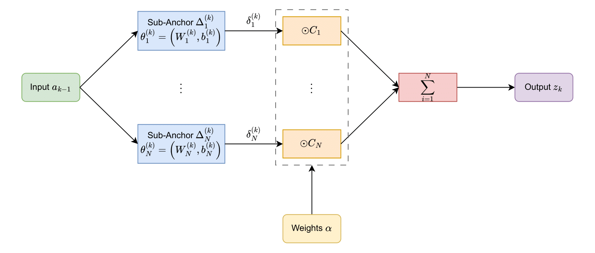

# Subspace Agents

## Linear Subspace Module

The `LinearSubspace` module allows to create specific hidden layers that can be subdivided into $n_{anchors}$ independent parts. Their respective outputs are then combined with a sum weighted by a sampled Dirichlet distribution.

**Figure 1.** LinearSubspace Module

## Actor

The actor used to decide the next action, is actually a sequence of two distinct agents: `AlphaAgent` and `SubspaceAction`. This sequence is called `SubspaceActionAgent`.

### AlphaAgent

The `AlphaAgent` is used to sample Dirichlet distributions, and thus to get sampled policies for [training](./training.md). In multitask scenarios, the weights of the distributions are equally sampled on the former subspace (without the last anchor added) and on the new subspace. Sampling both on the former and new subspaces allows to find more well-performing policies, as it easier to find good policies on the former, already trained, subspace than it is on the newer subspace.

**NB:** in monotask scenarios, there is only a single subspace as it doesn't really make sense to consider a subspace with an anchor less than the number of initial anchors.

### SubspaceAction

The `SubspaceAction` agent is a gaussian actor used to compute the `action_logprobs`. It leverages a neural network using `LinearSubspace` modules. As such, the anchors are not exactly trained independently, because the output of the first layer, that depends on all the anchors, is used as an input to the next layer.

## Critic

The `AlphaCritic` agent used is actually very similar to standard critics. The only difference is that the Dirichlet distribution of the evaluated policy is given as an input to the network. This allows to better generalize on every policy of the subspace, rather than on a specific sampled policy.