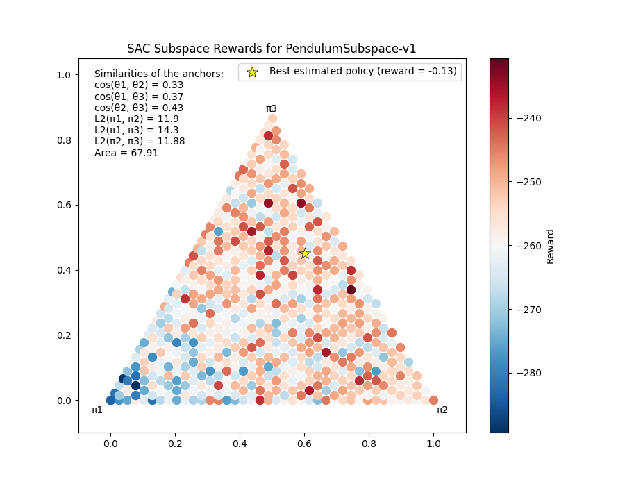

# Subspace Visualization Tools

## Reward curves

The first kind of figures that is plotted during an execution is the reward curves. They represent the maximum and average rewards of the subspace, based on a certain number of sampled policies, over time. The anticollapse coefficient and the number of evaluation environments, which defines the number of sampled policies, are both interesting parameters to tinker with. Thus, the greater it is, the more reliable the estimations of the subspace rewards. However, a high number of evaluation environments drastically increase the training time.

**Figure 1.a.** *CartPole Reward Curves for 500 samples*

**Figure 1.b.** *Pendulum Reward Curves for 500 samples*

## Subspaces with 3 anchors

Subspaces with exactly 3 anchors can also be represented as triangles whose vertices are the subspace anchors. Sampling policies within this triangle (the actual number depends on the `num_points` hyperparameter) and evaluating them allows to get a heatmap of the local performances of the subspace.

During a single training, several visualizations can be saved at different timesteps thanks to the `thresholds` hyperparameter. Anyway, the subspace is plotted at the end of [best policy estimation](./pruning.md) phase. In this case, the best policy of the subspace is displayed as well.

Finally, it is also possible to get an interactive view of the subspace with `Plotly` by setting the `interactive` hyperparameter to `True`.

**Figure 2.b.** *CartPole Subspace after 1.000.000 steps*

**Figure 2.b.** *Pendulum Subspace after 1.000.000 steps*

**NB:** in the case of the CartPole environment, the heatmap colorbar is fixed because the rewards are necessarily between 0 and 500. This makes easier the comparison of different subspace visualizations.